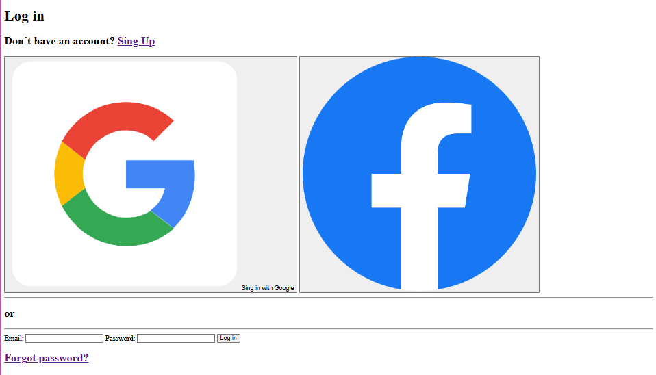

# 📝 Formulario de Log In – Proyecto HTML

Este es un proyecto sencillo en HTML que representa una **página de inicio de sesión** con opciones para iniciar sesión mediante Google o Facebook, así como un formulario clásico con email y contraseña.

---

## 📂 Estructura del proyecto

- /assets//images/ - google_13170545.png - facebook_5968764.png
- index.html
- README.md

---

## 📸 Vista previa

> Página de log in con botones para autenticación social, separador visual y formulario clásico de acceso.

---

## ✨ Funcionalidades

- ✅ Título principal con encabezado `<h1>`.
- ✅ Botones de inicio de sesión con Google y Facebook (con imágenes).
- ✅ Separador con la palabra **"or"** entre opciones sociales y el formulario.
- ✅ Formulario de log in con campos para email y contraseña.
- ✅ Enlaces para registrarse y recuperar contraseña.

---

## 🚀 Cómo usar este proyecto

1. Clona el repositorio o descarga los archivos.
2. Asegúrate de tener las imágenes en la ruta `assets/images/`.
3. Abre `index.html` en tu navegador.
4. ¡Listo!

---

## 🛠️ Tecnologías usadas

- HTML5

---

## 🙌 Autor

**Paula Calvo**
